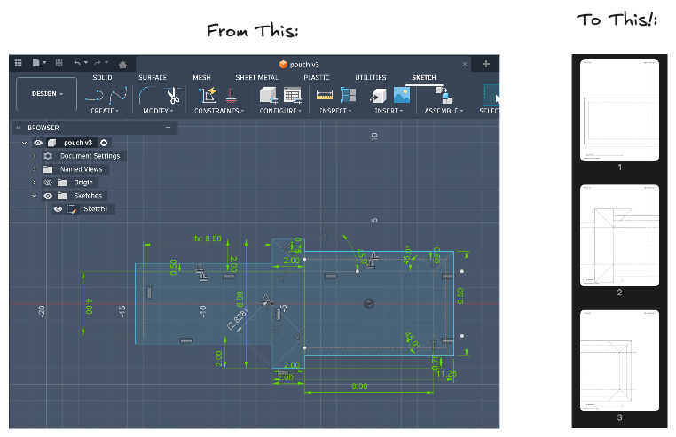
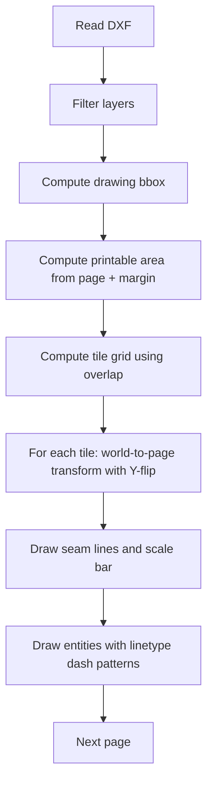

# DXF → Tiled PDF Pattern Printer



Reads a DXF drawing and produces a multi-page PDF where the drawing is **tiled** across pages for printing and taping together as a full-size pattern.

Each page includes a header showing the tile position (`col: 1/3  row: 1/1`).

The first page also includes a 100 mm scale bar so you can verify the printout is at correct 1:1 scale.

## Install

Download the pre-built binary for your platform from the `mac/` or `linux/` folder and put it somewhere on your PATH. No runtime dependencies required.

```bash
# macOS (Apple Silicon)
cp mac/dxf2pdf /usr/local/bin/dxf2pdf

# Linux (ARM64)
cp linux/dxf2pdf /usr/local/bin/dxf2pdf
```

## Quick start

Defaults: letter paper, 10 mm margin, 10 mm overlap, DXF units = inch.
Output path is optional; omitting it writes `<input>.pdf`.

```bash
# Generate letter-sized tiles (writes input.pdf)
dxf2pdf input.dxf

# Explicit output path
dxf2pdf input.dxf output.pdf

# DXF coordinates in millimeters
dxf2pdf input.dxf --dxf-units mm
```

The tool will **error** if the output PDF already exists (it will not overwrite).

## Command-line reference

```text
dxf2pdf [options] INPUT_DXF [OUTPUT_PDF]
```

### Positional arguments

| Argument | Description |
|---|---|
| `INPUT_DXF` | Path to the DXF file to read |
| `OUTPUT_PDF` | *(optional)* Output path. Defaults to `<input>.pdf` |

### Options

| Flag | Default | Description |
|---|---|---|
| `--page {letter,a4}` | `letter` | Paper size |
| `--margin-mm <float>` | `10.0` | Page margin in millimeters |
| `--overlap-mm <float>` | `10.0` | Tile overlap in millimeters |
| `--dxf-units {mm,inch}` | `inch` | What one DXF world unit represents |
| `--layers L1,L2,...` | *(all)* | Comma-separated layer names to include |
| `--no-dashed` | off | Skip entities with non-continuous linetypes |

## How distances and scaling work

The tool produces a PDF at **true 1:1 size** assuming you pick the correct `--dxf-units`.

### Unit systems

- **Millimeters (mm)**: fpdf's working unit; used for all page layout.
- **DXF world units (wu)**: the coordinate system stored in the DXF.
  - `--dxf-units mm` → 1 wu = 1 mm
  - `--dxf-units inch` → 1 wu = 25.4 mm

### The coordinate transform

For each tile, DXF coordinates $(x, y)$ are mapped to page coordinates as:

$$
\begin{aligned}
 x_{mm} &= \text{margin} + (x_{wu} - x_{tile0}) \cdot s \\
 y_{mm} &= (\text{pageH} - \text{margin}) - (y_{wu} - y_{tile0}) \cdot s
\end{aligned}
$$

Where:
- $s$ is the scale factor (mm per world unit)
- $(x_{tile0}, y_{tile0})$ is the tile's world-space origin (bottom-left)
- The $y$ formula includes a **Y-flip** because DXF is Y-up and PDF is Y-down

### `--overlap-mm` and `--margin-mm` are always millimeters

Even when `--dxf-units inch`, these flags describe physical paper layout, not drawing units. The tool converts them to world units internally by dividing by the scale factor.

## Page layout

```text
+----------------------------------------------------+  paper edge
|                                                    |
|  col: 1/3  row: 1/1          (header)              |
|  [100 mm scale bar]          (first page only)     |
|                                                    |
|   +--------------------------------------------+   |
|   |                                            |   |
|   |   DXF geometry for this tile               |   |
|   |                                            |   |
|   +--------------------------------------------+   |
|                                                    |
|  World origin: (0.00, 0.00) inch   (footer)        |
+----------------------------------------------------+
```

### Edge-alignment marks (tape without measuring)

When overlap > 0, dashed seam lines show exactly where the adjacent page's paper edge should land.

- Tiles with a **right neighbor**: vertical dashed line at the column seam.
- Tiles with an **upper neighbor**: horizontal dashed line at the row seam.

Assembly workflow:

1. Put tile `col: 1/N  row: 1/M` down.
2. Place the next tile on top.
3. Align its paper edge to the dashed seam line.
4. Tape. Repeat across columns then rows.

## Tiling

### Step size and overlap

```
step_w = printable_w_wu - overlap_wu
step_h = printable_h_wu - overlap_wu
```

Two neighboring tiles share `overlap_wu` of geometry:

```text
Tile i:   [-------- printable_w_wu --------]
Tile i+1:              [-------- printable_w_wu --------]
                        ^^^^ overlap_wu ^^^^
           |<-- step_w -->|
```

If `step_w ≤ 0` or `step_h ≤ 0`, the tool errors: overlap is too large.

### Tile count

```
nx = max(1, ceil((drawing_w - overlap_wu) / step_w))
ny = max(1, ceil((drawing_h - overlap_wu) / step_h))
```

Pages are emitted column-first within each row:

```
row 2:  (col 1, row 2)  (col 2, row 2)  (col 3, row 2)
row 1:  (col 1, row 1)  (col 2, row 1)  (col 3, row 1)
row 0:  (col 1, row 0)  (col 2, row 0)  (col 3, row 0)
```

### Pipeline



## Examples

```bash
# Letter paper, default overlap
dxf2pdf pouch.dxf

# A4, 10 mm overlap, DXF in mm
dxf2pdf input.dxf output.pdf --page a4 --dxf-units mm

# Only specific layers
dxf2pdf input.dxf --layers CUT,MARKS,NOTCHES

# Omit dashed construction lines
dxf2pdf input.dxf --no-dashed

# No overlap (harder to align, fewer pages)
dxf2pdf input.dxf --overlap-mm 0
```

## Supported DXF entities

| Entity | Notes |
|---|---|
| `LINE` | |
| `LWPOLYLINE` | |
| `POLYLINE` | |
| `CIRCLE` | |
| `ARC` | Bounding box is conservative (full circle); flattened to polyline for rendering |
| `SPLINE` | Flattened via de Boor's algorithm |
| `ELLIPSE` | Flattened parametrically |
| `POINT` | Rendered as a small filled dot |

`TEXT` and `MTEXT` are not rendered.

## DXF linetypes

Entities may set `linetype` directly (e.g. `DASHED`) or inherit it from their layer (`BYLAYER`). The linetype table in the DXF defines the dash/gap pattern in world units, which is scaled and applied as a PDF dash pattern.

Use `--no-dashed` to skip all non-continuous entities (useful for printing only cut lines, omitting reference/construction lines).

## Verifying scale

1. Print the **first page** at **100% / Actual Size** — do not scale to fit.
2. Measure the scale bar on the printout: it should be exactly 100 mm.

If it doesn't measure 100 mm, your PDF viewer or printer is scaling the output.

## Troubleshooting

| Symptom | Likely cause |
|---|---|
| Wrong physical size | `--dxf-units` is wrong, or printer is scaling |
| Too many pages | Stray entity far from the drawing; reduce overlap or margin |
| No geometry found | DXF contains only unsupported entity types |
| Scale bar missing | You're not on the first page |

## Building from source

Requires Go (tested with 1.24+). From inside the devcontainer:

```bash
# Run tests
go test ./...

# Build for macOS (Apple Silicon)
GOOS=darwin GOARCH=arm64 go build -o mac/dxf2pdf .

# Build for Linux (ARM64)
GOOS=linux GOARCH=arm64 go build -o linux/dxf2pdf .
```
